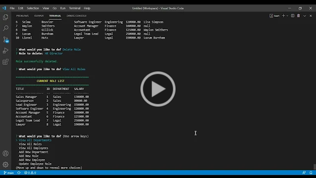

# Employee Tracker

## Description
This project is a command line interface (CLI) employee tracker. With it you can add, view, and delete departments, employee roles, and employees. You can also change an employees role and manager, view employees by department, and view department budgets based upon combined employee salaries. It was created using Node.js, MySQL, Inquirer, Console.table, and Chalk.

## Walkthrough video
[](https://drive.google.com/file/d/1HLe_wmxrORUfxppWUtstPVinWiyDVIO3/view)

## Installation
To install necessary dependencies run the following command:
```bash
npm i
```

## Usage
To launch the app run the following commands in your root of your project:
```bash
npm start
```
OR
```bash
node index.js
```
and then follow the prompts.

## Questions
If you have questions about this repo, open an issue or contact me directly at todd@theharveysplace.com. You can find more of my work at [tharveyster](https://github.com/tharveyster).

## License
MIT